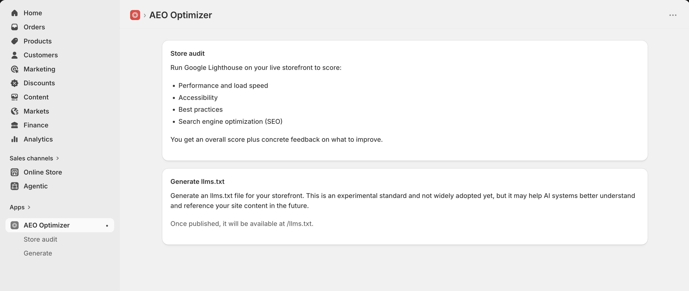
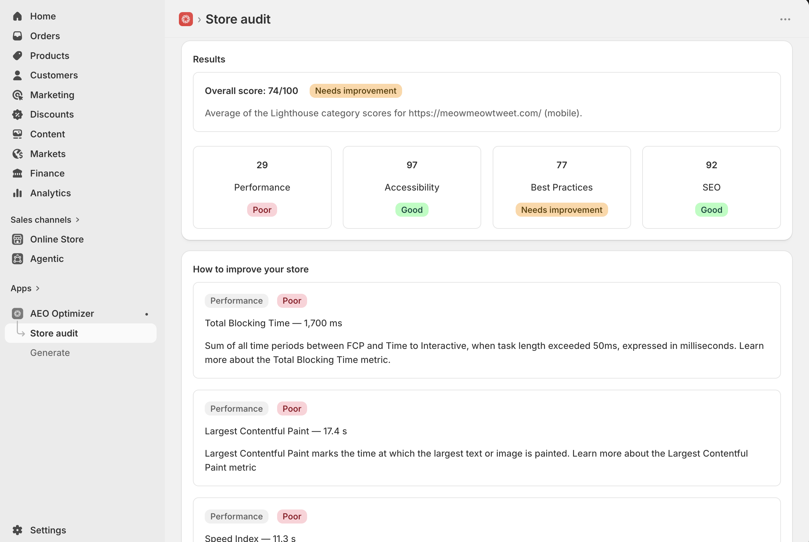
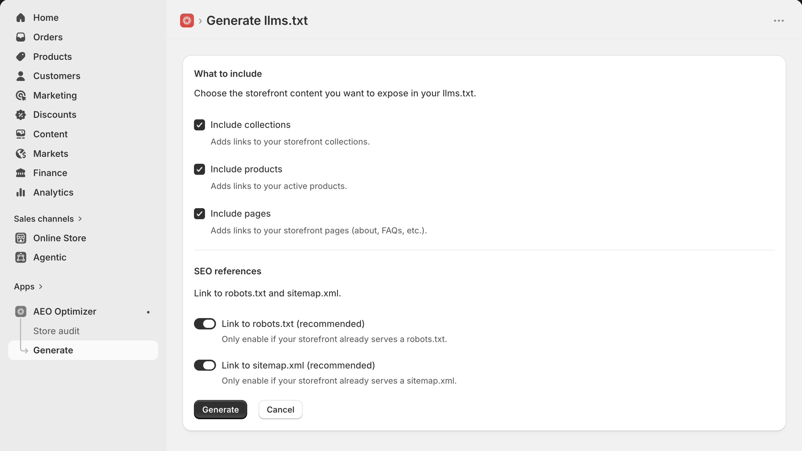

# AEO Optimizer

A Shopify app for **Answer Engine Optimization (AEO)** — helping your storefront get found and understood by both search engines and AI systems.

It does two things:

1. **Store audit** — runs Google Lighthouse against your live storefront and scores performance, accessibility, best practices, and SEO, with concrete suggestions on what to fix.
2. **Generate llms.txt** — builds and publishes an [llms.txt](https://llmstxt.org/) file for your storefront so AI systems can better discover and reference your content.

## Install

Open the link below and enter your `.myshopify.com` domain to install the app on your store:

**[Install AEO Optimizer](https://aeo-optimizer.fly.dev/auth/login)**

You'll be taken through Shopify's standard OAuth screen to approve the app's permissions, then land in the app inside your Shopify admin.



## Features

### Store audit

Runs Google Lighthouse (via the PageSpeed Insights API) on your live storefront and reports an overall score plus per-category breakdowns. Each failing metric comes with an explanation of what it measures and how to improve it.



### Generate llms.txt

Choose which storefront content to expose — collections, products, pages — and optionally link your existing `robots.txt` and `sitemap.xml`. Once published, the file is served from your storefront at `/llms.txt`.



> llms.txt is an experimental standard and not widely adopted yet, but it may help AI systems better understand and reference your site content in the future.

## Tech stack

- [React Router 7](https://reactrouter.com/) with [`@shopify/shopify-app-react-router`](https://shopify.dev/docs/api/shopify-app-react-router)
- [Polaris web components](https://shopify.dev/docs/api/app-home) for the embedded admin UI
- [Prisma](https://www.prisma.io/) + SQLite for session storage, replicated to object storage with [Litestream](https://litestream.io/)
- Hosted on [Fly.io](https://fly.io/) at https://aeo-optimizer.fly.dev

### Access scopes

| Scope | Used for |
| --- | --- |
| `read_products` | Listing collections and products in llms.txt |
| `read_online_store_pages` | Listing storefront pages in llms.txt |
| `write_online_store_navigation` | Publishing the llms.txt file to the storefront |

## Local development

Prerequisites: [Node 20+](https://nodejs.org/), [pnpm](https://pnpm.io/), and the [Shopify CLI](https://shopify.dev/docs/apps/tools/cli).

```shell
pnpm install
pnpm run dev
```

`pnpm run dev` runs `shopify app dev`, which handles auth, tunneling, and environment variables, and installs the app on your development store.

Set `PSI_API_KEY` (a Google Cloud API key with the PageSpeed Insights API enabled) in `.env` for the store audit to work locally.

## Deployment

| What changed | Command |
| --- | --- |
| App code | `fly deploy` — or just push to `main` (GitHub Actions deploys automatically) |
| App config (`shopify.app.toml`: scopes, webhooks, URLs) | `pnpm run deploy` (`shopify app deploy`) |

Runtime secrets (`SHOPIFY_API_SECRET`, `PSI_API_KEY`, Litestream's S3 credentials) are managed with `fly secrets set`.
